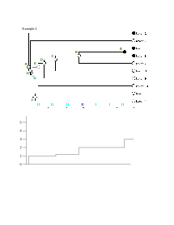
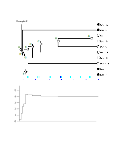

```{r, include = FALSE}
knitr::opts_chunk$set(
  collapse = TRUE,
  comment = "#>"
)
```

The statetimer package is designed to count character states through time, much 
like the approach of lineages through time. In the case of statetimer, we use 
estimation of character history on an evolutionary tree to track how the number 
of lineages with a character state in question changes through time. In this 
vignette, I provide a description of the algorithm, a pair of hypothetical 
examples, and how statetimer functions can be used in practice.

# Algorithm

1. Perform ancestral state estimation with maximum likelihood.
2. Sum the number of contemporary nodes that have the state of interest (state 
$i$). This is the initial value for $S_{i,0}$, the number of lineages 
with state $i$.
3. Enumerate all $n$ non-contemporary nodes of the tree, starting with the 
youngest node, so all nodes (including non-contemporary terminal nodes) are 
enumerated, $1...n$.
4. Moving backwards through time, find the next youngest node, node $j$. Store 
the marginal likelihood of that node possessing state $i$, $L_{i,j}$ and 
the age of the node, $t_{j}$.
5. Find all descendant nodes of node $j$. Sum the marginal likelihoods of 
descendant nodes having state $i$, $L_{i,d}$.
6. From the lineage count at node $j - 1$, $S_{i,j-1}$, subtract the 
sum of the descendant node likelihoods, $L_{i,d}$, then add the marginal 
likelihood of node _j_ possessing state $i$, $L_{i,j}$:
$$
S_{i,j} = S_{i,j-1} - L_{i,d} + L_{i,j}
$$
The resulting value is the estimated number of lineages with state $i$ at time 
$t_{j}$.
7. Repeat steps 3 through 5 until the root of the tree is reached.


# Examples

## Example 1

+ Considering terminal taxa with filled circles to have the state of interest 
(Figure 1), we start with $S_{i,0} = 3$, where $S_{i,0}$ is the number of
contemporary nodes with the state of interest, $i$.
+ Moving backwards through time, the youngest node is $A$. The likelihood of 
node $A$ having state $i$ is 1.0 (or near enough for us to consider it equal to 
1.0) and the sum of the marginal likelihoods of descendants of node $A$ is 2.0 
(the likelihood of state $i$ taxon 5 (1.0) plus the likelihood of state $i$ for 
taxon 6 (1.0)). So we calculate the number of lineages at time $t_{A}$ as:
$$
S_{i,j} = S_{i,0} - L_{i,d} + L_{i,A}
$$
or
$$
S_{i,j} = 3.0 - 2.0 + 1.0 = 2.0
$$
So the number of lineages with state $i$ at time $t_{A}$ is 2.0.
+ Moving to the next youngest node, $B$, we have $S_{i,j-1} = 2.0$ and 
$L_{i,B} = 0.1$. The two descendent nodes of $B$ are $A$ and taxon 7, which 
have marginal likelihoods of state $i$ of 1.0 and 0.0, respectively. 
Calculating the lineages at time $t_{B}$ is then:
$$
S_{i,j} = 2.0 - (1.0 + 0.0) + 0.1 = 1.1
$$        
+ Moving to node $C$, $S_{i,j-1} = 1.1$ and $L_{i,C} = 0.0$ (or nearly so). The 
descendants are node $B$ and taxon 8, so the sum of their marginal likelihoods 
for state $i$ is 0.1 + 0.0 = 0.1. The lineages at time $t_{C}$ is then:
$$
S_{i,j} = 1.1 - 0.1 + 0 = 1.0
$$
+ Moving backwards through time, the number of lineages with state $i$ does not 
much change until the root node, which has taxon 1 ($L_{i} = 1.0$) and node H 
($L_{i,H} = 0.0$) as the descendent nodes. The value of $S_{i,j-1}$ is 1.0, so 
our final value of the number of lineages at the base of the tree ($t_{R}$) is:
$$
S_{i,j} = 1.0 - (1.0 + 0.0) + 0.0 = 0.0
$$


## Example 2

+ Considering terminal taxa with filled circles to have the state of interest 
(Figure 2), we start with $S_{i} = 4$.
+ Moving backwards through time, the youngest node is $A$. The likelihood of 
node $A$ having state $i$ is 0.0 and the sum of the marginal likelihoods of 
descendants of node $A$ is 0.0 (the likelihood of state $i$ taxon 5 (0.0) plus 
the likelihood of state $i$ for taxon 6 (0.0)). So we calculate the number of 
lineages at time $t_{A}$ as:
$$
S_{i,j} = S_{i,j-1} - L_{i,d} + L_{i,A}
$$
or
$$
S_{i,j} = 4.0 - 0.0 + 0.0 = 4.0
$$
So the number of lineages with state $i$ at time $t_{A}$ is 4.0.
+ Moving to the next youngest node, $B$, we have $S_{i,j-1} = 4.0$ and 
$L_{i,B} = 0.05$. The two descendent nodes of $B$ are $A$ and taxon 7, which 
both have marginal likelihoods of state $i$ of 0.0. Calculating the lineages at 
time $t_{B}$ is then:
$$
S_{i,j} = 4.0 - (0.0 + 0.0) + 0.05 = 4.05
$$
Notice this value is _higher_ than the total number of contemporary lineages 
with state $i$.
+ Moving to node $C$, $S_{i,j-1} = 4.05$ and $L_{i,C} = 0.1$. The descendants 
are node $B$ and taxon 8, so the sum of their marginal likelihoods for state
$i$ is 0.05 + 0.0 = 0.05. The lineages at time $t_{C}$ is then:
$$
S_{i,j} = 4.1 - 0.05 + 0.1 = 4.15
$$
+ Moving to node $D$, $S_{i,j-1} = 4.15$ and $L_{i,D} = 0.2$. Summing the 
marginal likelihoods for descendants $C$ ($L_{i,C} = 0.1$) and taxon 9 
($L_{i,9} = 0.0$), we have $L_{i,d} = 0.1$. So the number of lineages with 
state $i$ at time $t_{D}$ is:
$$
S_{i,j} = 4.15 - 0.1 + 0.2 = 4.25
$$
In the graph, the rise in the number of lineages with state $i$ is now quite 
visible. Consider for a moment our original equation for calculating the number 
of lineages with state $i$ at time $t_{j}$:
$$
S_{i,j} = S_{i,j-1} - L_{i,d} + L_{i,j}
$$
The change of the number of lineages, $L_{i,j} - L_{i,d}$, is usually negative, 
because usually $L_{i,j} < L_{i,d}$. But at this point, we can see that the 
converse is true, $L_{i,j} > L_{i,d}$, because the likelihood at node $D$ (0.2) 
is greater than the sum of the likelihoods of immediate descendants (0.1 + 0.0).
+ When we get to node $F$, the trend changes. The likelihood of state $i$ in 
node $F$, $L_{i,F} = 0.5$ and the sum of the likelihoods for the two 
descendants, taxon 3 and taxon 4, $L_{i,d} = 2.0$. So our equation is (at this 
point, $S_{i} = 4.4$):
$$
S_{i,j} = 4.4 - 2.0 + 0.5 = 2.9
$$
+ The decreasing (backwards through time) continues to the root node, $R$, 
which still has a non-zero marginal likelihood of state $i$ (very close to 
0.5). The two descendants are taxon 1 (marginal likelihood of state $i$ = 1.0) 
and node $H$ (marginal likelihood of state $i$ = 0.5). The resultant number of 
lineages with state $i$ at time $t_{R}$, with $S_{i,j-1} = 1.2$ is:
$$
S_{i,j} = 1.2 - (1.0 + 0.5) + 0.5 = 0.2
$$


# Usage

```{r setup}
# library(statetimer)
```
